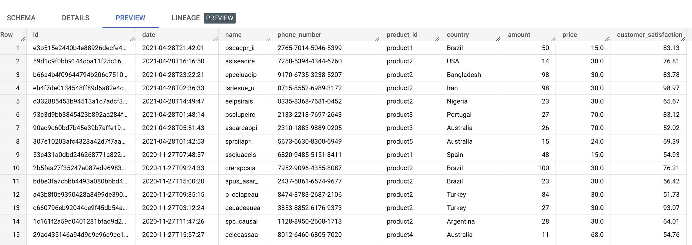

# bigdata-generator

This program can be used for generating large amounts of data for stress-testing big data solutions.
For each of the fields you want to generate, you can specify rules for generating their values:
- Random between 2 numbers, Dates, Strings
- Ramdon values from a predefined set of options
- Random values following a regex expression
- Value from a dictionary by using as an input another field

Once the set of dinamically generated rows is generated, you can configure the location in which you want to save it:
- Bigquery table
- GCS: AVRO, CSV
 
The program runs as part of an Apache BEAM pipeline. You can either run it locally or using Dataflow.

## Example

[Here](doc/example.md) you can find an end-to-end example of the outcome of this project.



## Config file

The documentation for configuring the rules for generating the data and where to store the generated data can be found [here](doc/config.md)

## Install

IMPORTANT: If the job is going to be executed using Dataflow, the Python version you use in your local environment (for submitting the job) must match the Python version used in the Dockerfile

Python version
```
python --version
Python 3.9.2
```

[Dockerfile](Dockerfile) Python version
```
FROM apache/beam_python3.9_sdk:2.44.0
```

Installing the local dev environment
```
python3 -m venv env
source env/bin/activate
pip3 install -r requirements.txt
```

## Run

### Configuring environment variables

```
TMP_BUCKET=bigdata-poc-temp-9584
PROJECT=name-of-your-gcp-project
REGION=us-central1
SUBNETWORK=default
REPO=bigdata-generator
TAG=latest
IMAGE_URI=gcr.io/$PROJECT/$REPO:$TAG
```

### Run locally using DirectRunner

```
CONFIG_FILE_PATH=./config_file_samples/sales_sample_bigquery.json
source env/bin/activate
python3 main.py \
    --runner DirectRunner \
    --config_file_path ${CONFIG_FILE_PATH} \
    --temp_location gs://${TMP_BUCKET}/tmp/ 
```
### Run using Dataflow

If this is the first time running it (or you made a change to `lib.py`), you will need to build the container image. 
NOTE: you don't need to rebuild the container image if you change `main.py`

```
gcloud builds submit . --tag $IMAGE_URI
```

When running the program using Dataflow, the config file needs to be stored in GCS.
Upload the config file to GCS, for example:
```
CONFIG_FILE_PATH=gs://${TMP_BUCKET}/config.json
gsutil cp config_file_samples/sales_sample_bigquery.json $CONFIG_FILE_PATH
```

submitting the Dataflow job
```
source env/bin/activate
python3 main.py \
    --region ${REGION} \
    --runner DataflowRunner \
    --project ${PROJECT} \
    --config_file_path ${CONFIG_FILE_PATH} \
    --temp_location gs://${TMP_BUCKET}/tmp/ \
    --no_use_public_ips \
    --sdk_container_image ${IMAGE_URI} \
    --sdk_location=container \
    --subnetwork=https://www.googleapis.com/compute/v1/projects/${PROJECT}/regions/${REGION}/subnetworks/${SUBNETWORK}
```

## Architecture

This project was developed using a GCP sandbox that has policies that make the configuration and execution of the process more secure (like using Dataflow workers without public IP or Internet access) but it also makes it more complex. 

Given these restrictions, a custom Dataflow container is being used (defined by the [Dockerfile](Dockerfile)) that installs the dependencies. The Dataflow job is submitted to run inside a VPC with no public IP address.

Feel free to run the data generator process as best fits your needs.

